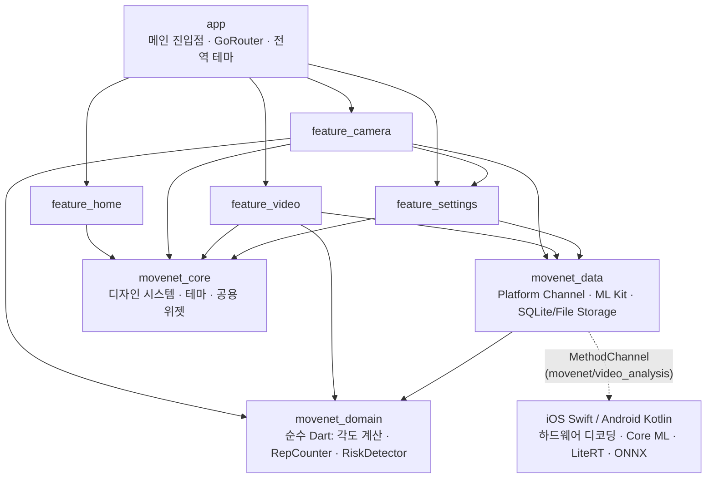

# FlutterMovenet 🏋️‍♂️

> **카메라와 앨범 영상에서 온디바이스로 운동 자세를 분석하고 실시간 피드백을 제공하는 Flutter 크로스플랫폼 애플리케이션**

FlutterMovenet은 딥러닝 포즈 추정(Pose Estimation) 모델을 활용하여 풀업, 스쿼트, 푸쉬업 등 주요 근력 운동의 반복 횟수를 자동으로 카운팅하고, 관절 각도를 분석하여 올바른 자세 코칭 및 부상 위험 알림을 제공하는 헬스케어 코칭 앱입니다.

외부 서버로 영상을 전송하지 않는 **100% 온디바이스(On-device) AI 추론 파이프라인**을 구축하여, 사용자의 프라이버시를 안전하게 보호하고 네트워크 환경과 무관하게 실시간으로 부드러운 분석 성능을 제공합니다.

---

## 📌 프로젝트 개요

- **하이브리드 엔진 설계**: UI 및 상태 관리, 비즈니스 도메인 로직은 Flutter/Dart로 공통화하고, 연산 집약적인 고해상도 영상 디코딩 및 신경망 추론은 iOS(Core ML, AVFoundation) 및 Android(LiteRT/TFLite, ONNX Runtime) 네이티브 가속 엔진에 위임했습니다.
- **모듈형 멀티 패키지(Melos)**: 기능 및 레이어별로 7개의 독립 패키지로 모듈화하여 관심사를 명확히 분리하고, 순수 Dart 도메인 로직은 Flutter 프레임워크 의존성 없이 단위 테스트가 가능하도록 설계했습니다.
- **다양한 운동 분석 지원**:
  - **반복 카운팅 및 자세 코칭**: 풀업(Pull-up), 스쿼트(Squat), 푸쉬업(Push-up)
  - **행동 패턴 분류**: MoViNet (Kinetics-600) 모델을 활용한 러닝(Running), 걷기(Walking) 및 전신 활동 분류

### 기술 스택

| 분류 | 기술 및 라이브러리 |
| --- | --- |
| **플랫폼** | Android (minSdk 24+), iOS (iOS 15.0+) — 실제 기기 타겟 |
| **언어** | Dart 3.x, Swift 5.x, Kotlin |
| **상태 관리** | Riverpod 3 (`riverpod_generator`, `freezed`) |
| **프로젝트 구조** | Melos + Dart Pub Workspace 기반 모듈형 멀티 패키지 |
| **온디바이스 ML** | Google ML Kit Pose Detection (실시간), MoveNet MultiPose Lightning, MoViNet A0 |
| **네이티브 추론 엔진** | **iOS**: Core ML (`.mlpackage`), AVAssetReader<br/>**Android**: LiteRT (TFLite), ONNX Runtime, MediaMetadataRetriever |
| **라우팅 & UI** | GoRouter, FlexColorScheme, Custom Canvas Painter (스켈레톤 오버레이) |
| **테스트** | 단위 테스트(Unit Test), 위젯 테스트(Widget Test), 골든 테스트(Golden Test) |
| **협업 & 워크플로우** | Git Flow (`develop` · `feature/*` · `fix/*` · `release/*` · `main`) |

---

## 📂 프로젝트 구조 (Project Structure)

본 프로젝트는 **Melos** 기반의 모듈형 멀티 패키지(Workspace Monorepo) 구조로 구성되어 있습니다. 각 레이어와 기능이 명확한 책임을 가지며 패키지 단위로 격리되어 있습니다.

```text
FlutterMovenet/
├── android/                         # Android 네이티브 소스
│   └── app/src/main/kotlin/...      # MethodChannel 핸들러, LiteRT(TFLite), ONNX Runtime 추론 엔진
├── ios/                             # iOS 네이티브 소스
│   └── Runner/                      # VideoAnalysisChannel, AVAssetReader 디코딩, Core ML 추론
├── MLModels/                        # 온디바이스 모델 파일 (MoveNet, MoViNet 원본 및 가중치)
├── lib/                             # 메인 앱 진입점 및 루트 오케스트레이션
│   ├── main.dart                    # ProviderScope 초기화 및 앱 실행
│   └── src/
│       ├── app.dart                 # MaterialApp.router 설정, 테마 및 화면 전환 구성
│       └── router.dart              # GoRouter 라우팅 테이블 및 커스텀 페이지 전환 애니메이션
├── packages/                        # 레이어 및 기능 단위 멀티 패키지 모듈
│   ├── movenet_core/                # [Core] 공통 테마(Colors, Typography), 재사용 UI 컴포넌트
│   ├── movenet_domain/              # [Domain] 순수 Dart 비즈니스 로직 (각도 계산, 반복 카운터, 위험 감지)
│   ├── movenet_data/                # [Data] 플랫폼 채널 브릿지, ML Kit 연동, 영상/기록 로컬 저장소
│   ├── feature_home/                # [Feature] 홈 대시보드 화면 (운동 선택, 최근 분석 기록 목록)
│   ├── feature_camera/              # [Feature] 실시간 카메라 분석 화면 (실시간 스켈레톤 및 코칭 피드백)
│   ├── feature_video/               # [Feature] 비디오 정밀 분석 화면 (프레임 탐색, 리포트 카드, 스냅샷)
│   └── feature_settings/            # [Feature] 앱 환경설정 화면 (카메라 방향, 신뢰도 임계값 설정)
├── test/                            # 루트 레벨 통합 및 라우트 화면 전환 테스트
├── melos.yaml                       # Melos 멀티 패키지 워크스페이스 정의 및 일괄 빌드/테스트 스크립트
├── pubspec.yaml                     # 루트 프로젝트 의존성 설정
└── analysis_options.yaml            # Dart 정적 분석 및 린트 룰셋
```

### 패키지별 상세 역할

| 패키지 | 계층 | 의존성 | 주요 역할 |
| --- | --- | --- | --- |
| `movenet_domain` | 도메인 | 없음 (순수 Dart) | 관절 3차원/2차원 각도 계산, 운동 종목 판별(`ExerciseClassifier`), 반복 횟수 카운터(`RepCounter`), 부상 위험 감지(`RiskDetector`), 전신 분석 파이프라인(`FormAnalyzer`) |
| `movenet_data` | 데이터 | `movenet_domain`, Flutter SDK | 네이티브 플랫폼 채널 통신(`VideoAnalysisReader`), 실시간 ML Kit 어댑터(`PoseDetectorService`), 분석 기록/영상 영속화(`AnalysisStorage`, `VideoStorage`) |
| `movenet_core` | 코어 UI | Flutter SDK | 일관된 디자인 시스템 테마(`MovenetTheme`), 카드 및 레이아웃 공용 위젯(`SectionCard`) |
| `feature_home` | 피처 | `movenet_core`, `movenet_data`, Riverpod | 운동 시작 런처 및 이전 분석 기록 요약 대시보드 |
| `feature_camera` | 피처 | `movenet_core`, `movenet_data`, `movenet_domain` | 실시간 카메라 피드 처리, 스트림 백프레셔 관리, 실시간 스켈레톤 캔버스 렌더링, 음성/시각 코칭 |
| `feature_video` | 피처 | `movenet_core`, `movenet_data`, `movenet_domain` | 비디오 파일 15fps 프레임 분석 제어, 타임라인 시크바 연동, 위험 구간 스냅샷 카드, 분석 리포트 그래프 |
| `feature_settings` | 피처 | `movenet_core`, `movenet_data` | 전/후면 카메라 선택, FPS 및 스켈레톤 토글, 모델 신뢰도(Confidence) 임계값 조정 |

---

## 🏛️ 소프트웨어 아키텍처



### 아키텍처 설계 원칙

1. **단방향 의존성 (`Feature → Data → Domain`)**: 도메인 계층은 외부 프레임워크나 플랫폼에 종속되지 않는 순수 Dart 라이브러리로 유지하여 유지보수성과 테스트 용이성을 극대화했습니다.
2. **반응형 상태 관리**: Riverpod 3의 Code Generation 기반 `Notifier`와 Freezed 불변 객체를 결합하여 안정적이고 예측 가능한 상태 흐름을 구축했습니다.
3. **하드웨어 인터페이스 캡슐화**: 카메라 하드웨어 스트림이나 플랫폼 채널은 `movenet_data` 계층 내부로 완전히 추상화되어 상위 UI 레이어는 데이터 소스의 물리적 구현을 신경 쓰지 않습니다.

---

## ⚡ 주요 기능

- **실시간 카메라 운동 분석**:
  - 카메라 이미지 스트림을 ML Kit Pose Detection으로 실시간 추정
  - 관절 랜드마크 각도를 기반으로 실시간 반복 횟수(Rep Count) 카운팅 및 폼 피드백 표시
  - 실시간 프레임 드롭 및 백프레셔 방지 플래그(`_busy`) 적용
- **영상 파일 정밀 분석**:
  - 갤러리 영상 파일을 네이티브 세션에서 15fps 단위로 순차 디코딩 및 MoveNet MultiPose 추론
  - 클립 구간 누적을 통해 MoViNet 기반 600개 행동 클래스 분류
- **상세 분석 리포트**:
  - 운동 수행 시간, 총 반복 횟수, 케이던스(분당 반복수, RPM), 가동 범위(ROM) 제공
  - 상체 기울기, 무릎 및 팔꿈치 각도 궤적 시각화
  - 운동 종목 판별 불확실성 발생 시 후보 종목 목록 및 확률 제시
- **부상 위험 각도 감지 및 타임라인 스냅샷**:
  - 팔꿈치/무릎 과신전(Hyperextension), 무릎/고관절 과굴곡(Hyperflexion) 감지
  - 위험 발생 시점의 고해상도 스냅샷을 캡처하여 리포트에 기록 (관절별 1초 쿨다운 적용, 최대 5건)
  - 위험 카드를 탭하면 비디오 플레이어가 해당 순간으로 즉시 탐색(Seek)
- **인터랙티브 스켈레톤 오버레이**:
  - 영상 재생 위 실시간 스켈레톤 관절 라인 및 각도 수치 표시
  - 가로 모드(좌우 분할) 및 세로 모드 풀스크린 뷰 지원
- **분석 히스토리 보관함**:
  - 영상 클립, 섬네일, 분석 메타데이터를 로컬에 영속화
  - 저장된 이전 분석 기록 다시 보기, 재분석, 삭제 기능 제공

---

## 🔌 네이티브 연동 (Flutter ↔ Swift / Kotlin)

영상 분석은 프레임별 고해상도 디코딩과 심층 신경망 추론 비용이 크기 때문에 Flutter 엔진 외부의 네이티브 백그라운드 스레드에서 처리합니다. `movenet/video_analysis` MethodChannel을 통해 **세션 기반 프로토콜**을 구현했습니다.

### MethodChannel 프로토콜 규격

| 메서드 | 인자 | 응답 | 설명 |
| --- | --- | --- | --- |
| `open` | `path: String, fps: Int` | `id: String, durationUs: Long, estimatedFrameCount: Int, width: Int, height: Int` | 영상을 열고 네이티브 디코더 및 추론 세션 초기화 |
| `next` | `id: String` | `timeUs: Long, keypoints: Float32List, thumbnailPath?: String` | 다음 프레임 디코딩 + MoveNet 포즈 추정 (완료 시 `null`) |
| `snapshot` | `id: String` | `imagePath: String` | 위험 각도 감지 시 현재 프레임의 고해상도 JPEG 스냅샷 저장 |
| `classify` | `id: String` | `logits: Float32List (600)` | 누적된 비디오 프레임 텐서를 MoViNet 모델에 전달하여 분류 |
| `close` | `id: String` | `void` | 네이티브 메모리 해제 및 세션 리소스 정리 |

### 플랫폼별 네이티브 구현 비교

| 항목 | iOS ([VideoAnalysisChannel.swift](ios/Runner/VideoAnalysisChannel.swift)) | Android ([MainActivity.kt](android/app/src/main/kotlin/com/example/flutter_movenet/MainActivity.kt)) |
| --- | --- | --- |
| **비디오 디코딩** | `AVAssetReader` (BGRA 픽셀 버퍼 출력) | `MediaMetadataRetriever` (Bitmap 추출) |
| **포즈 추정** | Core ML MoveNet MultiPose (`.mlpackage`) | LiteRT (TFLite) MoveNet MultiPose |
| **행동 분류** | Core ML MoViNet A0 | ONNX Runtime MoViNet A0 |
| **스레딩 모델** | 전용 백그라운드 `DispatchQueue` → 메인 스레드 응답 | 단일 스레드 `ExecutorService` → 메인 `Handler` 응답 |
| **메모리 최적화** | CVPixelBuffer 재사용 및 직접 포인터 접근 | Direct ByteBuffer 할당 및 비트맵 풀링 |

---

## 💡 주요 기술 문제 해결 (Troubleshooting)

1. **iOS 앱 업데이트/재설치 시 저장된 영상 경로 무효화 문제**
   - **원인**: iOS 샌드박스는 앱 재설치나 업데이트 시 컨테이너의 UUID 디렉토리 경로가 변경되므로 기존 절대 경로로 저장된 영상 파일에 접근 불가
   - **해결**: 앱 기동 시 `AnalysisStorage.rebasePaths` 로직을 통해 저장된 경로의 컨테이너 루트를 현재 앱 컨테이너 경로로 동적 치환하는 매핑 레이어 구현 및 단위 테스트 검증
2. **GoRouter 화면 이동 간 전환 애니메이션 누락 문제**
   - **원인**: `GoRouter` 기본 `builder` 사용 시 상위 테마를 감지하지 못해 `NoTransitionPage`로 전환되어 화면이 끊겨 보이는 현상 발생
   - **해결**: `pageBuilder`에서 플랫폼 테마의 전환 효과(`pageTransitionsTheme`)가 온전히 적용되는 `MaterialPage`를 명시적으로 인스턴스화하여 부드러운 화면 전환 제공
3. **소형 디바이스 화면에서 리포트 그리드 오버플로우(RenderFlex Overflow)**
   - **원인**: 고정 픽셀 높이를 가정한 그리드 및 통계 행 레이아웃이 화면 폭이 좁은 디바이스에서 렌더링 에러 유발
   - **해결**: 유연한 `LayoutBuilder` 및 반응형 제약 조건으로 변경하고, 다양한 해상도에 대한 골든 테스트(Golden Test)를 구축하여 레이아웃 회귀 방지
4. **가로 모드(Landscape) 비디오 분석 뷰 깨짐 대응**
   - **원인**: 세로 방향 단일 컬럼 위주 레이아웃으로 인해 회전 시 컨트롤러와 영상이 겹치거나 잘림 현상 발생
   - **해결**: 가로 모드 감지 시 좌측 영상 플레이어 / 우측 리포트 및 타임라인으로 분할되는 반응형 듀얼 패널 레이아웃 적용
5. **네이티브 iOS 원본 알고리즘과의 분석 결과 오차 해결**
   - **원인**: 기존 네이티브 Swift 앱에서 검증된 각도 계산 알고리즘과 Flutter Dart 구현 간의 프레임 연산 타이밍 및 임계값 오차 존재
   - **해결**: Swift UseCase의 비즈니스 로직을 Dart `movenet_domain` 패키지로 1:1 포팅하고, 동일한 합성 궤적 데이터셋을 활용한 단위 테스트로 알고리즘 일치성 보장

---

## 🧪 테스트 및 품질 관리

```bash
# 전체 테스트 실행
dart run melos run test
```

- **`movenet_domain`**:
  - `rep_counter_test`: 풀업, 스쿼트, 푸쉬업 궤적 벡터 기반 반복 횟수 및 상태 전이(State Transition) 검증
  - `exercise_classifier_test`: 로짓 기반 운동 종목 확률 계산 및 임계값 테스트
  - `form_analyzer_test`: 위험 각도 감지 및 관절 쿨다운 로직 단위 검증
- **`movenet_data`**:
  - `analysis_storage_test`: iOS 컨테이너 UUID 변경 시의 경로 재바인딩(`rebasePaths`) 로직 검증
- **`feature_camera`**:
  - `camera_state_test`: 카메라 생명주기 및 상태 머신 테스트
- **`feature_video`**:
  - `pose_track_test`: 타임라인별 포즈 키포인트 정규화 및 탐색 로직 검증
  - `video_preview_test`, `page_transition_test`: 위젯 상호작용 테스트
  - `screen_golden_test`, `pose_overlay_golden_test`: 리포트 카드, 오버레이, 가로/세로 전체화면 5종 골든 이미지 테스트
- **`app`**:
  - `route_transition_test`: 화면 라우팅 및 전환 애니메이션 무결성 검증

---

## 🚀 시작하기 (Getting Started)

### 사전 요구사항
- Flutter SDK (3.24.0 이상 권장)
- Android Studio / Xcode (iOS 15.0+ 또는 Android minSdk 24+ 실제 기기 권장)
- Melos CLI (`dart pub global activate melos`)

### 설치 및 실행

```bash
# 1. 의존성 패키지 설치
flutter pub get

# 2. Freezed 및 Riverpod 코드 생성
dart run melos run generate

# 3. 전체 패키지 정적 분석 (Lint)
dart run melos run analyze

# 4. 전체 패키지 테스트 실행
dart run melos run test

# 5. 앱 실행 (실제 기기 연결 권장)
flutter run
```

> ⚠️ **주의사항**: 카메라 실시간 프레임 연동 및 네이티브 Core ML / TFLite 가속 연산 특성상, 에뮬레이터나 시뮬레이터보다는 **Android / iOS 실제 기기**에서 실행하는 것을 권장합니다.

---

## 🌿 브랜치 전략 (Git Flow)

본 프로젝트는 안정적인 버전 관리와 품질 유지를 위해 **Git Flow** 전략을 따릅니다.

- `main`: 프로덕션 배포 및 공식 태그(`v1.0.0`) 관리 브랜치
- `develop`: 기능 개발 통합 및 지속적 통합(CI) 브랜치
- `feature/*`: 단위 기능 개발 브랜치 (`feature_camera`, `feature_video` 등)
- `fix/*`: 버그 수정 및 레이아웃 회귀 해결 브랜치
- `test/*`: 테스트 케이스 및 골든 테스트 구축 브랜치
- `release/*`: 릴리스 준비 및 최종 검증 브랜치
