# FlutterMovenet

카메라와 앨범 영상에서 **온디바이스로 운동 자세를 분석**하는 Flutter 크로스플랫폼 앱입니다.
풀업·스쿼트·푸쉬업의 반복 횟수를 세고, 관절 각도를 바탕으로 코칭과 위험 자세 알림을 제공합니다.

네이티브 iOS 앱(Swift)으로 먼저 만든 분석 파이프라인을 Flutter로 옮기면서,
**UI·도메인 로직은 Dart로 공유**하고 **디코딩·모델 추론은 플랫폼 채널로 Swift/Kotlin 네이티브에 맡기는** 구조로 설계했습니다.

| 항목 | 내용 |
| --- | --- |
| 플랫폼 | Android(minSdk 24), iOS — 실제 기기 기준 |
| 언어 | Dart, Swift, Kotlin |
| 상태 관리 | Riverpod 3 (`riverpod_generator`, `freezed`) |
| 구조 | Melos + Dart pub workspace 기반 멀티 패키지(기능 단위 모듈) |
| 온디바이스 ML | ML Kit Pose Detection(실시간), MoveNet MultiPose Lightning, MoViNet(Kinetics-600) |
| 네이티브 추론 | iOS: Core ML(`.mlpackage`) · Android: LiteRT(TFLite) + ONNX Runtime |
| 테스트 | 단위 테스트, 위젯 테스트, 골든 테스트 |
| 협업 | Git Flow(`feature/*` · `fix/*` · `test/*` · `release/*`), `v1.0.0` 태그 |

---

## 주요 기능

- **실시간 카메라 분석**: 카메라 이미지 스트림을 ML Kit로 포즈 추정 → 관절 각도로 운동 종목 추정, 반복 횟수, 종목별 코칭 표시
- **영상 분석**: 앨범 영상을 네이티브에서 15fps로 순차 디코딩하며 프레임별 포즈 추정, MoViNet으로 운동 종목 분류
- **분석 리포트**: 상체 기울기·무릎/팔꿈치 각도·케이던스 등 지표, 종목 판정이 애매하면 후보 목록 제시
- **위험 각도 감지**: 팔꿈치·무릎 과신전, 무릎·고관절 과굴곡을 감지해 스냅샷 저장(관절별 1초 쿨다운, 최대 5건). 카드를 누르면 영상이 그 순간으로 이동
- **관절 오버레이**: 영상 재생 위에 스켈레톤과 각도 표시, 가로/세로 전체 화면 지원
- **분석 기록**: 영상·섬네일·결과를 로컬에 저장하고 다시 보기/재분석/삭제
- **설정**: 전면/후면 카메라, 스켈레톤·FPS 표시, 최소 신뢰도

---

## 아키텍처

```mermaid
graph TD
  app[app<br/>라우터·테마·진입점] --> fh[feature_home]
  app --> fc[feature_camera]
  app --> fv[feature_video]
  app --> fs[feature_settings]
  fc --> fs
  fc --> data[movenet_data<br/>플랫폼 채널·ML Kit·저장소]
  fv --> data
  fs --> data
  fc --> domain[movenet_domain<br/>순수 Dart 분석 로직]
  fv --> domain
  data --> domain
  fh --> core[movenet_core<br/>공통 테마·위젯]
  fc --> core
  fv --> core
  fs --> core
  data -. MethodChannel .-> native[iOS Swift / Android Kotlin<br/>디코딩·Core ML·TFLite·ONNX]
```



| 패키지 | 역할 |
| --- | --- |
| `movenet_domain` | Flutter 의존성이 없는 순수 Dart. 관절 각도 계산, 반복 횟수(`RepCounter`), 위험 감지(`RiskDetector`), 영상 전체 분석(`FormAnalyzer`), 종목 분류(`ExerciseClassifier`) |
| `movenet_data` | 외부 세계와의 경계. `VideoAnalysisReader`(플랫폼 채널), `PoseDetectorService`(ML Kit), 기록·영상·설정 저장소 |
| `feature_*` | 화면 단위 모듈. 각 기능은 Riverpod `Notifier` + `freezed` 상태로 구성 |
| `movenet_core` | 공통 테마와 UI 컴포넌트 |

**설계 의도**
- 분석 규칙을 순수 Dart 패키지로 분리해 **기기·카메라 없이 단위 테스트**가 가능하도록 했습니다.
- 기능별 패키지로 나눠 의존 방향(`feature → data → domain`)을 패키지 경계로 강제합니다.
- 하드웨어·플랫폼 의존 코드는 `movenet_data`에만 두어, 나머지 계층은 입력 소스(카메라/영상/네이티브)를 모릅니다.

---

## 네이티브 연동 (Flutter ↔ Swift/Kotlin)

영상 분석은 프레임 디코딩과 모델 추론 비용이 커서 Dart가 아닌 네이티브에서 처리합니다.
`movenet/video_analysis` MethodChannel로 **세션 기반 프로토콜**을 정의하고, iOS와 Android가 같은 계약을 각각 구현합니다.

| 메서드 | 인자 | 응답 | 설명 |
| --- | --- | --- | --- |
| `open` | `path`, `fps` | `id`, `durationUs`, `estimatedFrameCount`, `width`, `height` | 영상을 열고 디코딩 세션 생성 |
| `next` | `id` | `timeUs`, `keypoints`(Float32List), `thumbnailPath?` | 다음 프레임 디코딩 + MoveNet 포즈 추정. 끝이면 `null` |
| `snapshot` | `id` | JPEG 경로 | 마지막 프레임 저장(위험 각도 스냅샷) |
| `classify` | `id` | 600개 로짓 | 모아 둔 클립으로 MoViNet 분류 |
| `close` | `id` | – | 세션 정리 |

| | iOS ([VideoAnalysisChannel.swift](ios/Runner/VideoAnalysisChannel.swift)) | Android ([MainActivity.kt](android/app/src/main/kotlin/com/example/flutter_movenet/MainActivity.kt)) |
| --- | --- | --- |
| 디코딩 | `AVAssetReader` (BGRA) | `MediaMetadataRetriever` |
| 포즈 추정 | Core ML MoveNet MultiPose | LiteRT(TFLite) MoveNet MultiPose |
| 종목 분류 | Core ML MoViNet | ONNX Runtime MoViNet |
| 스레딩 | 전용 `DispatchQueue` → 메인 스레드 응답 | 단일 스레드 `Executor` → 메인 `Handler` 응답 |

- 프레임 단위 `next` 호출로 Dart 쪽에서 **진행률 표시와 취소**가 가능합니다.
- 키포인트는 `Float32List`로 주고받아 채널 직렬화 비용을 줄였습니다.
- 모델 로드 실패 시 `model_unavailable` 등 명시적 에러 코드를 돌려줍니다.

실시간 카메라는 `camera` 이미지 스트림을 ML Kit로 넘기며, 플랫폼별 픽셀 포맷(iOS `bgra8888`, Android `nv21`)과
센서 방향·기기 회전·전면 카메라 보정을 [PoseDetectorService](packages/movenet_data/lib/src/pose_detector_service.dart)에서 처리합니다.
프레임 처리 중에는 다음 프레임을 버려(`_busy` 플래그) 백프레셔를 막고, 종목 확률은 지수 이동 평균으로 흔들림을 줄였습니다.

---

## 문제 해결 사례

| 문제 | 원인 | 해결 |
| --- | --- | --- |
| 앱 재설치·업데이트 후 기록 영상이 재생되지 않음 | iOS는 재설치 시 데이터 컨테이너 UUID가 바뀌어 저장해 둔 절대 경로가 무효화됨 | 로드 시 파일이 없으면 현재 컨테이너 루트로 경로 앞부분을 교체(`AnalysisStorage.rebasePaths`) + 단위 테스트 |
| 화면 이동에 전환 애니메이션이 없음 | `go_router`에 `builder`만 주면 `NoTransitionPage`로 떨어짐 | `pageBuilder`에서 `MaterialPage`를 직접 생성해 테마의 전환이 적용되게 수정 + 전환 테스트 추가 |
| 좁은 폭에서 리포트 그리드·행이 넘침 | 고정 폭 가정 레이아웃 | 칸 높이 고정·유연 레이아웃으로 수정, 골든 이미지로 회귀 방지 |
| 가로 화면에서 영상 분석 화면이 깨짐 | 세로 기준 단일 컬럼 레이아웃 | 가로일 때 좌우 분할 레이아웃 |
| Flutter와 네이티브 iOS 앱의 분석 결과 불일치 | 각도·위험 감지 규칙이 플랫폼마다 달라질 위험 | iOS 원본 UseCase의 규칙을 도메인 패키지로 옮기고 동일 순서로 처리, 테스트로 고정 |

---

## 테스트

```
movenet_domain   rep_counter_test, exercise_classifier_test, form_analyzer_test
movenet_data     analysis_storage_test (컨테이너 경로 보정)
feature_camera   camera_state_test
feature_video    pose_track_test, video_preview_test, page_transition_test,
                 screen_golden_test, pose_overlay_golden_test (골든 5종)
app              route_transition_test
```

- 도메인 로직은 합성 포즈 데이터로 각도·반복 횟수·위험 감지 경계값을 검증합니다.
- UI는 골든 테스트(리포트 카드, 오버레이, 전체 화면 가로/세로, 빈 상태)로 레이아웃 회귀를 잡습니다.

---

## 개발 방식

- **Git Flow**: `develop`에서 `feature/*`, `fix/*`, `test/*` 브랜치를 나눠 작업하고, `release/v1.0.0`을 거쳐 `main`에 머지·태그했습니다. 커밋 메시지는 `feat:` / `fix:` / `test:` 접두어를 씁니다.
- **AI 개발 도구 활용과 검증**: Claude Code로 구현 초안과 버그 원인 분석을 진행하고, 결과는 기기 실행과 단위·골든 테스트로 직접 확인한 뒤 수정해 반영했습니다. 위 문제 해결 사례의 수정 커밋들은 모두 재현 → 원인 확인 → 테스트 추가 순서로 진행했습니다.
- **코드 생성**: `riverpod_generator`, `freezed`는 `build_runner`로 생성하며 Melos 스크립트로 전체 패키지에 일괄 실행합니다.

---

## 실행 방법

```bash
flutter pub get
dart run melos run generate   # riverpod / freezed 코드 생성
dart run melos run analyze    # 전체 패키지 정적 분석
dart run melos run test       # 전체 패키지 테스트
flutter run                   # Android/iOS 실제 기기 권장
```

> ML Kit 플러그인과 네이티브 모델 추론 특성상 Android/iOS 실제 기기에서 동작을 보장합니다.
> 모델 파일은 `MLModels/`(원본), `android/app/src/main/assets/models/`, `ios/Runner/Models/`에 있습니다.

---

## 채용 요건과 연결되는 경험

| 요건 | 이 프로젝트에서의 근거 |
| --- | --- |
| Flutter 앱 구조와 상태 관리 이해 | 기능별 멀티 패키지 구조, Riverpod 3 + `freezed` 상태 모델, 계층 간 의존 방향 설계 |
| 기기·하드웨어 연동 | 카메라 이미지 스트림 처리, 센서 방향·회전 보정, 플랫폼별 픽셀 포맷 대응, 프레임 백프레셔 처리 |
| Swift·Kotlin 네이티브 기능 연동 | MethodChannel 세션 프로토콜 설계 후 iOS(AVFoundation·Core ML)와 Android(LiteRT·ONNX Runtime) 각각 구현 |
| iOS·Android 양 플랫폼 유지보수 | iOS 컨테이너 경로 변경 대응, 가로/세로·좁은 화면 레이아웃 대응, 권한 문구(Info.plist) 설정 |
| Git 기반 협업 | Git Flow 브랜치 전략, 목적별 브랜치·커밋 규칙, 릴리스 브랜치와 버전 태그 |
| AI 개발 도구 활용 및 검증 | AI로 작성한 코드를 테스트·골든 이미지·실기기 실행으로 검증하고 수정 |
| 빌드·테스트 자동화 | Melos 스크립트로 코드 생성·정적 분석·테스트를 전체 패키지에 일괄 실행 |
